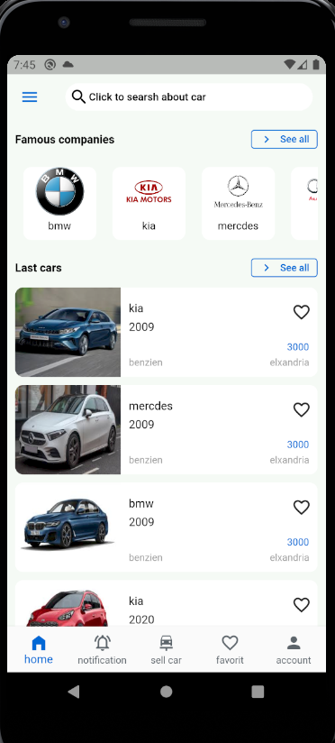
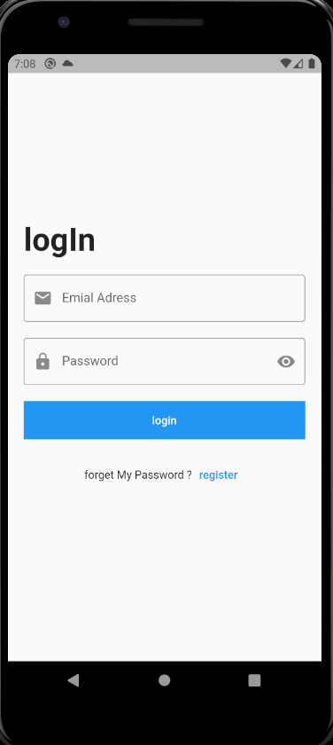
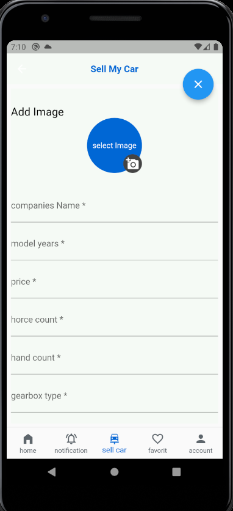
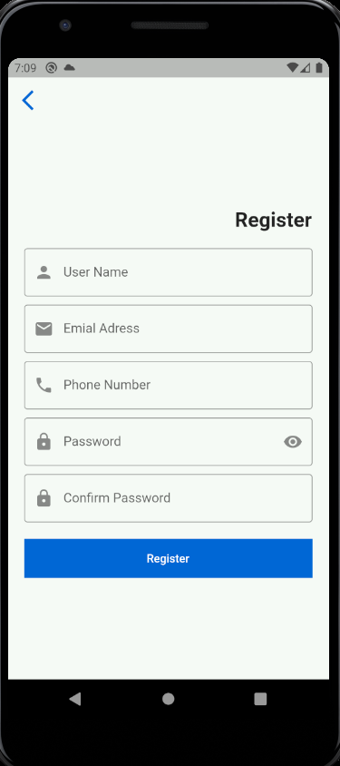
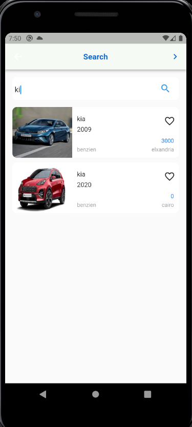
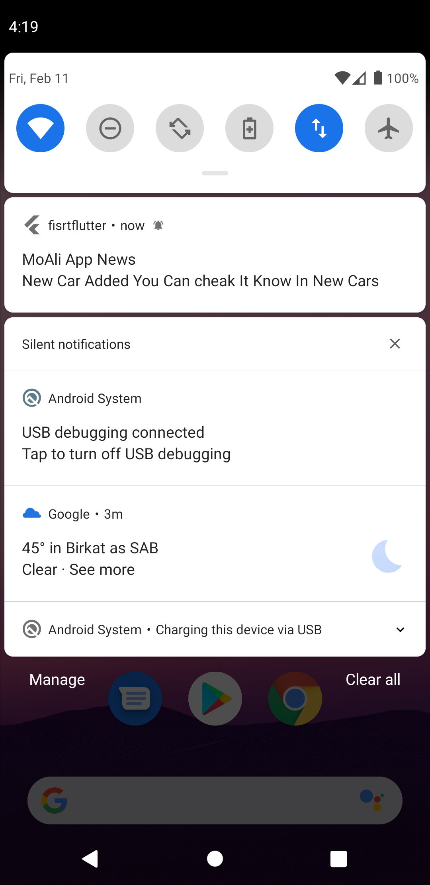
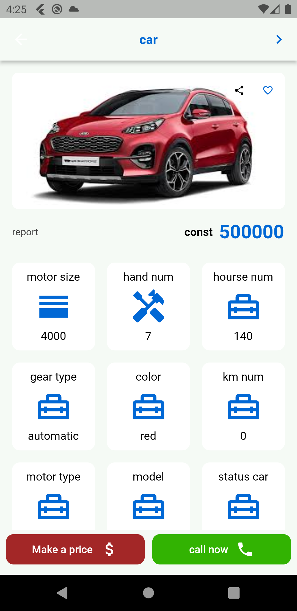
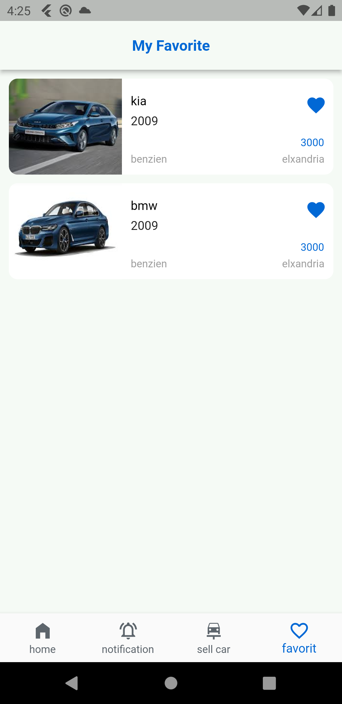

# fisrtflutter

A new Flutter project.

# moali car
## features
- Authentication (Log in ,Register)
- show cars
- search
- save in favorits
- log out
- add your cars to sell it
- notification

## Technology i used it
- sqflite
- firebase firestore
- firebase dataStorage
- firebase Auth
- Navigation
- getx
- Dependency injection (binding)
- async await
 

## home screen🌴🌴

 
 

## Log in 🌴🌴

 
 

## full property to sell car🌴🌴

 
 

## Register🌴🌴

 
 

## search screen🌴🌴

 
 

## notification🌴🌴

 
 

## drawer navigation🌴🌴

 
 

## property screen🌴🌴

 
 

## favorite screen🌴🌴

 
 
